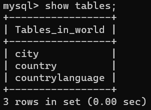
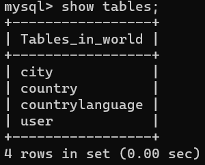
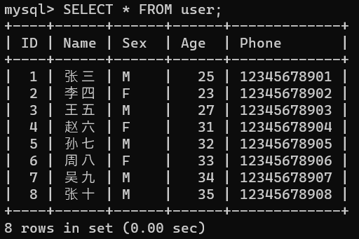
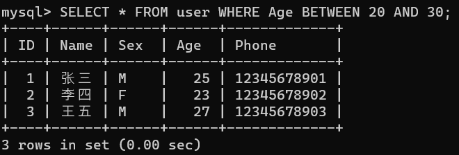
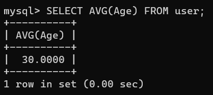
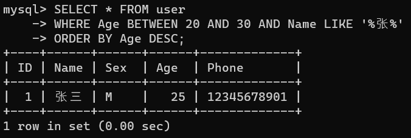
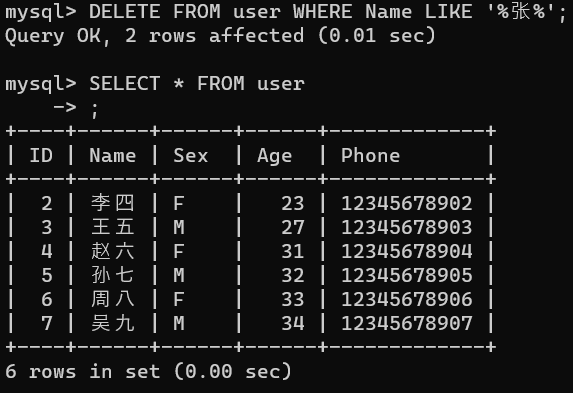
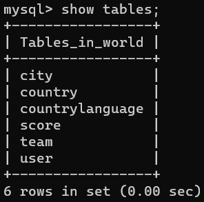
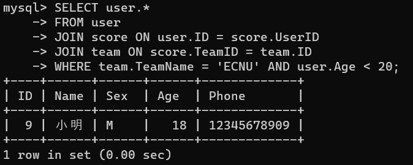
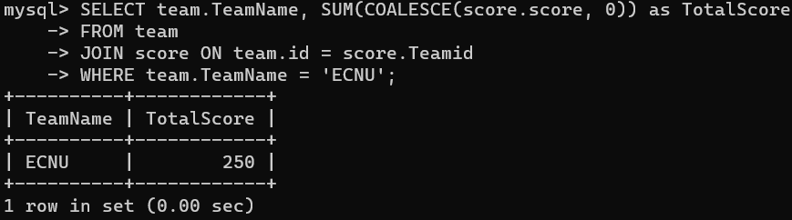

# MySQL基本操作(第七章践习题)
### 3.在新数据库中新建一张user表，插入几条数据，属性包含：唯一标识(id)，姓名(name)，性别(sex)，年龄(age)，联系方式(phone)。
<br>这是原数据库的表：
<br><center></center>
<br>我们输入下列语句，创建一个表：
```MySql
CREATE TABLE user(
    ID INT PRIMARY KEY,
    Name VARCHAR(8),
    Sex VARCHAR(1),
    Age INT,
    Phone VARCHAR(11)
);
```
<br>表创建成功：
<br><center></center>
<br>接下来我们插入数据：
```MySQL
INSERT INTO user (ID, Name, Sex, Age, Phone) VALUES (1, '张三', 'M', 25, '12345678901');
INSERT INTO user (ID, Name, Sex, Age, Phone) VALUES (2, '李四', 'F', 23, '12345678902');
INSERT INTO user (ID, Name, Sex, Age, Phone) VALUES (3, '王五', 'M', 27, '12345678903');
INSERT INTO user (ID, Name, Sex, Age, Phone) VALUES (4, '赵六', 'F', 22, '12345678904');
INSERT INTO user (ID, Name, Sex, Age, Phone) VALUES (5, '孙七', 'M', 24, '12345678905');
INSERT INTO user (ID, Name, Sex, Age, Phone) VALUES (6, '周八', 'F', 26, '12345678906');
INSERT INTO user (ID, Name, Sex, Age, Phone) VALUES (7, '吴九', 'M', 28, '12345678907');
```
<br>并更新数据：
```MySQL
UPDATE user SET Age = 31 WHERE ID = 4;
UPDATE user SET Age = 32 WHERE ID = 5;
UPDATE user SET Age = 33 WHERE ID = 6;
UPDATE user SET Age = 34 WHERE ID = 7;

INSERT INTO user (ID, Name, Sex, Age, Phone) VALUES (8, '张十', 'M', 35, '12345678908');
```
<br>键入以下指令查看我们的表：
```MySQL
SELECT * FROM user;
```
<br>得到：
<br><center></center>
### 4.查询user表中所有年龄在20-30范围内的用户。
<br>键入语句：
```MySQL
SELECT * FROM user WHERE Age BETWEEN 20 AND 30;
```
<br>得到：
<br><center></center>
### 6.计算user表中所有用户的平均年龄。
<br>键入：
```MySQL
SELECT AVG(Age) FROM user;
```
<br>得到：
<br><center></center>
### 7.查询user表中年龄在20-30内，名字包含“张”的用户，并按照年龄从大到小排序输出。
<br>在MySQL中，可以使用`LIKE`操作符来查询包含特定模式的字符串。键入：
```MySQL
SELECT * FROM user 
WHERE Age BETWEEN 20 AND 30 AND Name LIKE '%张%' 
ORDER BY Age DESC;
```
<br>得到：
<br><center></center>
<br>此处由于数据量太小没能展示按年龄排序的效果。
### 5.删除user表中名字包含“张”的用户。
<br>键入：
```MySQL
DELETE FROM user WHERE Name LIKE '%张%';
```
<br>得到：
<br><center></center>
<br>删除成功。
### 8.新建两张表，team表(id,TeamName)，score表(id,Teamid,userid,score)。其中，score表中的Teamid为指向team表id的外键，userid为指向user表id的外键。
<br>使用以下语句新建表并进行外键约束：
```MySQL
CREATE TABLE team (
    ID INT PRIMARY KEY,
    TeamName VARCHAR(4)
);

CREATE TABLE score (
    ID INT PRIMARY KEY,
    TeamID INT,
    UserID INT,
    Score INT,
    FOREIGN KEY (Teamid) REFERENCES team(id),
    FOREIGN KEY (userid) REFERENCES user(id)
);
```
<br>我们可以看到表创建成功：
<br><center></center>
### 9.查询TeamName为“ECNU”的队伍中，年龄小于20的用户们。
<br>键入以下语句：
```MySQL
SELECT user.* 
FROM user 
JOIN score ON user.ID = score.UserID 
JOIN team ON score.TeamID = team.ID 
WHERE team.TeamName = 'ECNU' AND user.Age < 20;
```
<br>发现结果：
<br><center></center>
<br>给出我们其他表的数据，会发现这是正确的：
<br><center></center>
### 10.计算TeamName为“ECNU”的用户的总分，score为null的以值0加入计算。
<br>键入以下语句：
```MySQL
SELECT team.TeamName, SUM(COALESCE(score.score, 0)) as TotalScore
FROM team
JOIN score ON team.id = score.Teamid
WHERE team.TeamName = 'ECNU';
```
<br>结果如下：
<br><center></center>